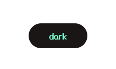

[sinbad theme link](https://github.com/lighto2000/sinbad-theme)
# main css file 
# header css file
# category css file
# home css file
# class css file
# main js file
> Ho To Use Class 

`<p class="btn-dark"> This How You Use The Style Class </p>`




> to use transform py file
```python

def move_to_repo(path):
    pass

def move_from_repo(path):
    pass

```

> DEVELOPED AND DESIGNED  BY :

| name          | email                          |
| ------------  | -------------------------------| 
| Hussein Naim :| husseinnaim.github@gmail.com   |
| Arwaa :       | rewaaalsawaferys@gmail.com     |

> AUTHOR 
[  link](https://instagram.com/cld.u)

